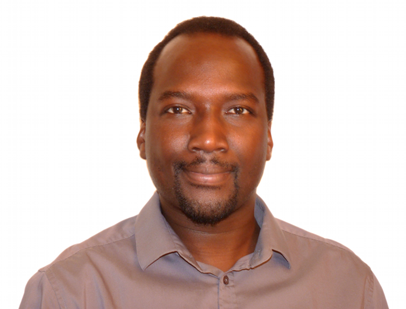

 

  

    

      
  

  

  

    

      I am currently a Senior Researcher at <a href="http://www.cnrs.fr/en">CNRS</a> (Directeur de Recherche) in the Microelectronics department of <a href="https://www.lirmm.fr/lirmm-en/">LIRMM</a> (Laboratory of Computer Science, Robotics and Microelectronics of Montpellier). I obtained my PhD degree from Rennes University in 2004. 
	 
		I am member of the <a href="https://www.lirmm.fr/teams-en/ADAC-en/">ADAC</a> (Adaptive Computing) research group, and deputy director of <a href="https://www.lirmm.fr/lirmm-en/">LIRMM</a>.
    

  

---

<h3> Research interests </h3>
- High-performance embedded systems
- Computer-aided design
- Energy-driven computing
- Sustainable computing

---
<h3> Recent publications </h3>

---

<b>Contact information:</b>
 
LIRMM -- UMR 5506 - CC477
 
161 rue Ada, 34095 Montpellier Cedex 5 - France
 
Phone: +33 4 67 14 98 28 / Fax: +33 4 67 41 85 00
 
Email: first.last@lirmm.fr (without accent in last)
 
  
  
  

